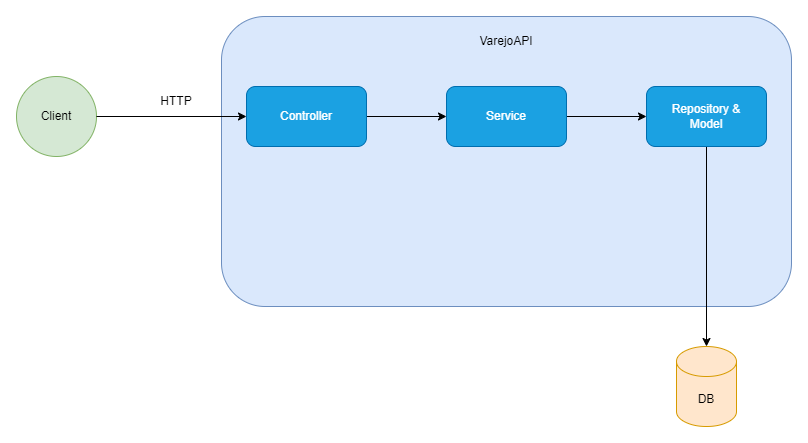

# VarejoAPI

VarejoAPI é uma API REST, implementada no padrão MVC, que expõe um endpoint para um recurso de Produtos.

## Quickstart

```
npm i
npm run dev
```

Endereço: `http://localhost:3000`

## Endpoints

Criar Produto
POST
/product

Listar Todos Produtos
GET
/product

Buscar Produto Por ID
GET
/product/:id

Buscar Produto Por Nome
GET
/product/name/:name

Alterar Produto
PUT
/product/:id

Deletar Produto
DELETE
/product/:id

Total de Produtos
GET
/count

## Arquitetura do Software

A arquitetura segue o padrão MVC e está detalhada no arquivo [docs](docs/Architecture.md).



## Estrutura de pastas e de componentes

A estrutura de pastas da aplicação implementa o padrão Controllers, Services, Respositories e Models, comum em aplicações Express, como forma de implementação do padrão MVC. A responsabilidade de cada componente está detalhada no arquivo [docs](docs/Architecture.md).

```
src/
├── controllers/       # Controladores HTTP
├── services/          # Lógica de negócio
├── repositories/      # Interação com banco de dados
├── models/            # Entidades de domínio
├── database/          # Configuração do banco de dados
├── containers/        # Dependency injection
├── routes/            # Definição de rotas
├── middlewares/       # Middlewares HTTP
├── app.ts             # Configuração interna da aplicação
└── server.ts          # Configuração externa da aplicação
```
