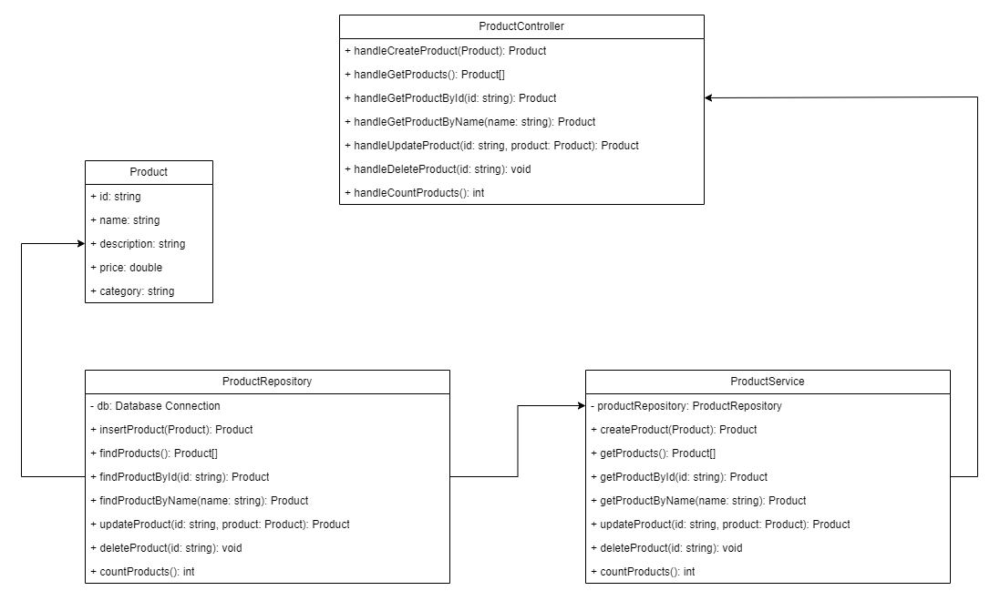

# VarejoAPI

VarejoAPI é uma API REST, implementada no padrão MVC, que expõe um endpoint para um recurso de Produtos.

## Arquitetura

A API segue uma arquitetura em camadas com separação clara de responsabilidades.


## Estrutura de Diretórios

```
src/
├── controllers/       # Controladores HTTP
├── services/          # Lógica de negócio
├── repositories/      # Interação com banco de dados
├── models/            # Entidades de domínio
├── database/          # Configuração do banco de dados
├── containers/        # Dependency injection
├── routes/            # Definição de rotas
├── middlewares/       # Middlewares HTTP
├── app.ts             # Configuração interna da aplicação
└── server.ts          # Configuração externa da aplicação
```

### Controllers

Responsáveis por gerenciar requisições HTTP. O Controller receberá a requisição HTTP vinda do cliente, fará a validação inicial da requisição e chamará os componentes responsáveis por produzir a resposta.

Ao final do fluxo, em nossa API rest, o Controller retornará ao cliente os dados necessários para exibição na View.

### Services

Responsáveis por tratar regras de negócios. Cada Service expõe funções que implementam a lógica de domínio da aplicação, orquestrando chamadas para repositories e aplicando validações específicas do negócio.

### Repositories

Responsáveis por gerenciar a camada de dados da aplicação. O Repository é quem fará a interação com o banco de dados e retornará entidades do sistema.

### Models

Models definem entidades de domínio, como um Produto. Os Models definem a estrutura de dados, tipos e validações para cada entidade no domínio da nossa aplicação.

## Modelagem



## Tecnologias

### Core

- TypeScript
- NodeJS
- Express

### Banco de Dados

- SQLite

## Padrões de Design

### Dependency Injection

Utilizado para desacoplar camadas e facilitar testes:

```typescript
// Container
const productRepository = new ProductRepository(db);
const productService = new ProductService(productRepository);

// Usage
const products = await productService.getProducts();
```

### Repository Pattern

Abstrai o acesso a dados:

```typescript
class ProductRepository {
  constructor(private readonly db: Database.Database) {}

  async findProducts(): Promise<Product[]> {
    // Database logic
  }
}
```

### Service Layer Pattern

Centraliza lógica de negócio:

```typescript
class ProductService {
  constructor(private readonly productRepository: ProductRepository) {}

  async getProducts(): Promise<Product[]> {
    return await this.productRepository.findProducts();
  }
}
```

## Fluxo de Dados

1. Request: Controller recebe requisição HTTP
2. Validation: Controller valida dados usando Zod
3. Business Logic: Controller chama Service
4. Data Access: Service chama Repository
5. Database: Repository executa query no SQLite
6. Response: Dados retornam através das camadas até o cliente

## Vantagens da Arquitetura

- Separação de responsabilidades: Cada camada tem função específica
- Testabilidade: Dependency injection facilita mocks
- Manutenibilidade: Código organizado e previsível
- Flexibilidade: Fácil troca de implementações
